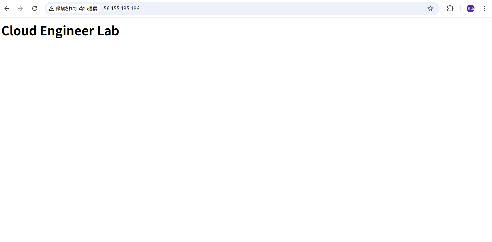

## Step2 VPC Infrastructure Creation

### Overview
Terraformを利用してAWS VPC環境をコード管理で構築。

### Created Resources

- VPC
- Internet Gateway
- Public Subnet
- Route Table
- Route Table Association

### Validation

Terraform実行結果:

terraform plan
→ Success

terraform apply
→ Success

AWS Management Consoleにて作成確認済み。

### Skills Learned

- Terraform基本操作
- AWSネットワーク基礎
- Infrastructure as Code(IaC)
- TerraformによるAWSリソース管理
## Step3 - EC2 Infrastructure Creation

### Current Progress

- Public Subnet作成（コード追加）
- Internet Gateway（未）
- Route Table（未）
- Security Group（未）
- EC2（未）
開発環境
Public Subnet
Internet Gatewayあり

で十分です。

本番環境

本番では、

Public Subnet（ALBのみ）
Private Subnet（EC2）
NAT Gateway
Internet Gateway

という構成が一般的です。

つまり、

EC2を直接インターネットへ公開しません。
## Security Group 設計

### Security Groupとは

EC2にアタッチするステートフルな仮想ファイアウォール。

### 今回の設計

- SSH(22): 自分のグローバルIPのみ許可
- HTTP(80): 全世界へ公開（検証用）

### 設計理由

- SSHは管理者のみが利用するため最小権限とする。
- HTTPはWebサーバーの動作確認を目的として公開する。

### 本番環境との違い

本番ではSSHをインターネットへ公開せず、AWS Systems Manager Session Managerなどを利用して管理することが一般的である。
## Terraform Security Group

### 作成リソース
- Security Group（terraform-web-sg）

### インバウンドルール
- SSH (TCP/22)：自分のグローバルIPアドレス（/32）のみ許可
- HTTP (TCP/80)：0.0.0.0/0（全世界）からのアクセスを許可

### アウトバウンドルール
- All Traffic（すべての通信）を許可

### 設計意図
- SSHは管理者のみが利用するため、最小権限の原則に従い自分のIPアドレスのみ許可した。
- HTTPはWebサーバーとして公開するため、全世界からのアクセスを許可した。
- Security Groupはステートフルな仮想ファイアウォールであり、許可した通信に対する戻り通信は自動で許可される。

### 実務での改善点
- 管理用IPアドレスは `terraform.tfvars` などで変数化する。
- 本番環境ではHTTPS（443）を利用し、HTTPからリダイレクトする構成が一般的。
- Systems Managerを利用し、SSH（22）を閉じる構成も選択肢となる。
## Terraformの構成について学んだこと

Terraformでは、`data`ブロックは`provider`の直後である必要はなく、ファイル内のどこに記述しても認識される。

実務では、可読性・保守性を高めるために、`data.tf`・`ec2.tf`・`network.tf`など役割ごとにファイルを分割して管理することが一般的である。
## EC2作成

### 設計意図

TerraformのData Source（data "aws_ami"）を利用し、Amazon Linux 2023の最新AMIを動的に取得する構成とした。

### 採用理由

- AMI IDはリージョンごとに異なるため、固定値では保守性が低い。
- 最新のAmazon公式AMIを取得することで、コードの再利用性を向上させた。

### terraform planレビュー

- 追加：EC2 1台
- 変更：なし
- 削除：なし

既存リソースへ影響がないことを確認してからterraform applyを実行した。
## EC2作成

### 構築内容

Terraformを利用してAmazon EC2インスタンスを作成した。

### 構成

- Amazon Linux 2023
- t3.micro
- Public Subnet
- Security Group
- Key Pair（cloud-lab-key）

### Terraform実行結果

- terraform plan
  - 1 to add
  - 0 to change
  - 0 to destroy

- terraform apply
  - EC2インスタンスを正常作成

### AWSコンソール確認

- EC2インスタンス作成確認
- Running状態確認
- Security Group関連付け確認

### 学んだこと

Terraformでは、planで変更内容を確認してからapplyすることが重要である。
## User Data設計

### 設計意図

EC2作成後の手作業を排除するため、User Dataを利用して初期設定を自動化した。

### 実務でのメリット

- 手動設定をなくせる
- サーバーごとの差異が発生しない
- 障害時も同じ構成を短時間で再構築できる
- Infrastructure as Codeを実現できる
## EC2再作成（Terraform Replace）

### 実施内容

Terraformの `-replace` オプションを使用してEC2インスタンスを再作成した。

### 実施コマンド

```powershell
terraform apply -replace="aws_instance.web_server"
結果
既存EC2を削除
新規EC2を作成
User Dataが初回起動時に自動実行された
学んだこと

User DataはEC2の初回起動時のみ実行されるため、既存インスタンスへ追加しただけでは実行されない。設定を反映させるには、EC2の再作成や適切な運用方法を選択する必要がある。
# EC2 Web Server

## Purpose

TerraformでEC2を構築し、
User Dataを利用してApacheを自動構築した。

## Why User Data?

手動構築ではなく

Infrastructure as Code

として

サーバーが何台増えても同じ構成になるようにした。

## Verification

- Terraform Apply 成功
- EC2作成成功
- SSH接続成功
- Apache起動確認
- cloud-initログ確認
- ブラウザ表示確認

## Troubleshooting

### SSH

秘密鍵の保存場所を指定する必要があった。
ssh -i C:\Users\user\Downloads\cloud-lab-key.pem ec2-user@PublicIP


### User Data

cloud-init-output.logで正常実行を確認した。

# Terraform AWS Environment Automation

## Overview

Terraformを利用してAWS VPC及びEC2環境を自動構築する。


## Architecture

VPC
 |
 Public Subnet
 |
 EC2
 |
 Apache Web Server


## Created Resources

- VPC
- Subnet
- Internet Gateway
- Route Table
- Security Group
- EC2
- Apache


## Automation

EC2 User Dataを利用し、
インスタンス起動時にApacheを自動インストール。


## Troubleshooting

### User Dataが再実行されない

原因:
User Dataは初回起動時のみ実行。

対応:
terraform apply -replaceでEC2再作成。


## Skills

- Terraform
- AWS VPC
- EC2
- Security Group
- Infrastructure as Code
## Terraform Output

Terraform Outputを利用して、
構築したAWSリソース情報を取得できるようにした。

取得情報:

- EC2 Instance ID
- EC2 Public IP
- VPC ID


## Troubleshooting

### terraform outputで値が表示されない

原因:

outputs.tf追加後、terraform applyを実行していなかった。


### Resource参照エラー

原因:

outputs.tfで存在しないResource名を指定。

修正:

aws_instance.web

↓

aws_instance.web_server

# Terraform AWS Environment Automation

## Project Overview

Terraformを利用してAWS環境をコード管理し、
VPCからEC2 Web Serverまで自動構築する。

## Architecture

構成:

VPC
 └ Public Subnet
    └ EC2
       └ Apache Web Server


## Created AWS Resources

- VPC
- Public Subnet
- Internet Gateway
- Route Table
- Security Group
- EC2 Instance


## EC2 Configuration

AMI:

Amazon Linux 2023


Instance Type:

t3.micro


Application:

Apache HTTP Server


## Automation

EC2 User Dataを利用し、
インスタンス起動時にApacheを自動インストール。

処理内容:

1. OS Update
2. Apache Install
3. Apache Enable
4. Apache Start
5. index.html作成


## Terraform Output

以下の情報をOutputとして取得可能。

- EC2 Instance ID
- EC2 Public IP
- VPC ID


## Troubleshooting


### terraform outputが表示されない

原因:

outputs.tf追加後にterraform applyを実行していなかった。


対応:

terraform plan

terraform apply

を実行してTerraform Stateへ反映。


---


### Reference to undeclared resource

原因:

outputs.tfで存在しないResource名を参照。


誤:

aws_instance.web


正:

aws_instance.web_server


Terraformではresource定義名が参照名になる。


## Verification

確認項目:

- SSH接続成功
- Apache稼働確認
- Browser HTTPアクセス成功


## Skills

- AWS VPC
- AWS EC2
- Security Group
- Terraform
- Infrastructure as Code
- Linux
- Apache
- Troubleshooting